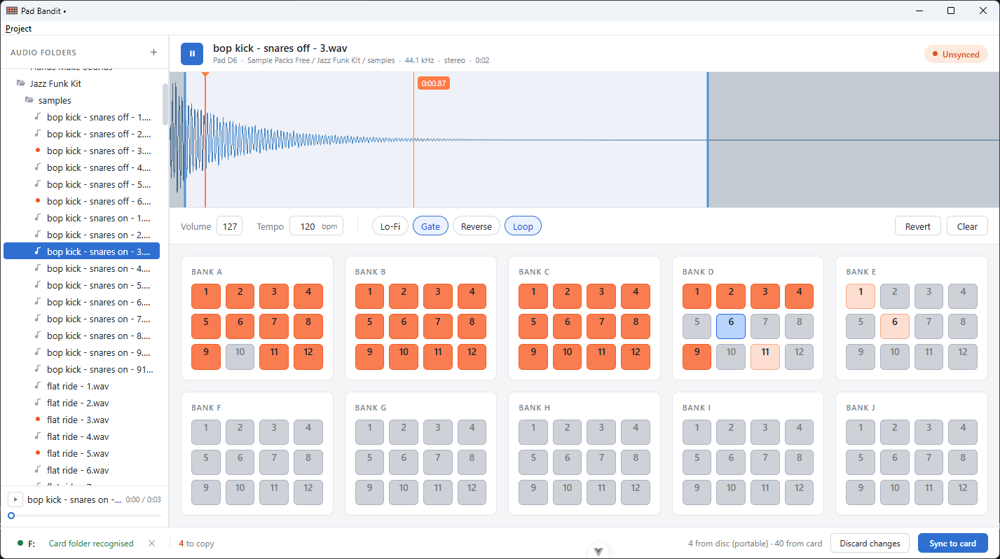

> 🚧 **Work in progress**

  <picture>
    <source srcset="assets/pad-bandit-logo-light.svg" media="(prefers-color-scheme: dark)" />
    
  </picture>

<h1 align="center"></h1>

Pad Bandit is an alternative editor for the Roland SP-404SX, inspired by tools like Bank Robber and [Super Pads]. It
provides quality-of-life improvements to the original Wave Converter workflow, including drag and drop, file tree
previews, waveform editing, and incremental sync.

#### 🔊 [Bandcamp] / [Soundcloud] / [Apple Music] / [Spotify]

 

## Features

- 🎛️ Pad management — Move and swap pads using drag & drop.
- 📁 File browser — Choose your own root folders, preview audio files, and drag them directly onto pads.
- 🌊 Waveform editor — Visually adjust the start and end points of the selected pad.
- ⚙️ Pad settings — Edit parameters such as Lo-Fi, Gate, Loop, and Volume.
- 🔄 Incremental sync — Only modified pads are synchronized instead of rewriting the entire bank.
- 💾 Projects — Save and restore complete pad-bank setups for easy recall and reuse.

## Tech Stack

- [Tauri] — Desktop application
- Rust — Native functionality
- [Vue.js] — UI

## Disclaimer

Pad Bandit is an independent, non-commercial project and is not affiliated with, endorsed by, or sponsored by Roland
Corporation.

Roland and SP-404SX are trademarks of their respective owners. Pad Bandit is provided as-is and should be used with
appropriate backups of your samples and SD cards.

[Super Pads]: https://github.com/MatthewCallis/super-pads
[Tauri]: https://tauri.app/
[Vue.js]: https://vuejs.org/
[Bandcamp]: https://loowps.bandcamp.com
[Soundcloud]: https://soundcloud.com/loowps
[Apple Music]: https://music.apple.com/us/artist/loowps/1326334750
[Spotify]: https://open.spotify.com/artist/2jOQrKX3rRoZORPfFcXaYU